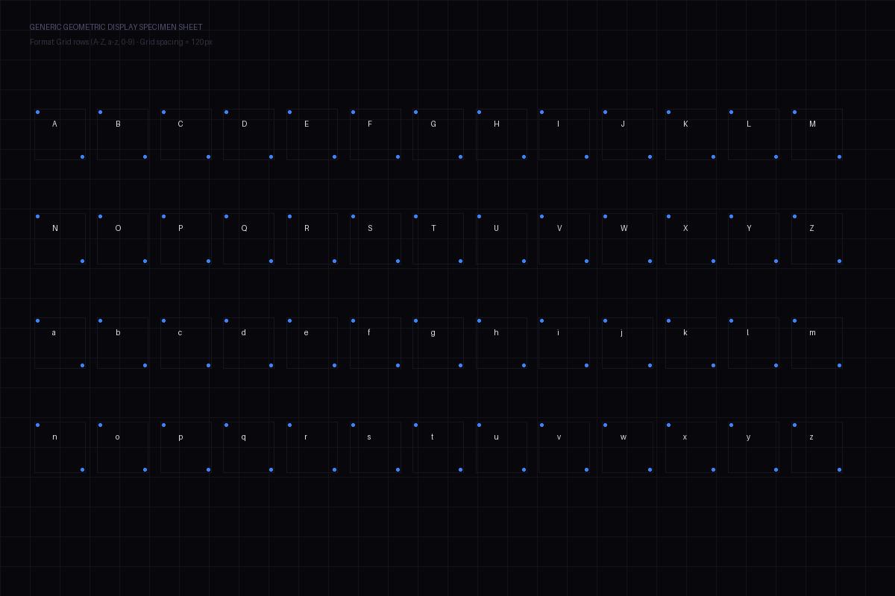

  <!-- AAA HERO BADGE -->
  
    

  <!-- AAA SECTION BADGES -->
  

    
    
    
  

  <!-- AAA TECH BADGES -->
  

    
    
    
  

---

# 🛠️ FONTS CREATOR & VISUALIZER SUITE

A professional, state-of-the-art toolkit to design, compile, and visualize custom vector fonts starting from simple hand-drawn or grid-based raster specimen sheets (PNG).

---

## ✨ Features

*   **Generic Raster-to-Vector Pipeline**: Automatically splits grid-based specimens into perfect character bounding boxes, extracts glyph contours, and converts them to vector formats.
*   **Geometric Snapping & Smoothing**: Features a configurable angle-snapping algorithm (e.g. 45° / 90° snapping) and morphological open/close edge filters to remove jaggies while keeping crisp details.
*   **Dual-Layer Symmetry Engine**: Mirror contours from left-to-right to ensure mathematically perfect symmetry at both vector sub-pixel and integer grid coordinates.
*   **Professional OpenType Tables**: Supports generating robust OS/2 vertical metrics, gasp screen-rendering hinting tables, copyright records, and customizable legacy format kerning maps.

---
Built with sovereignty by Ethernium Sovereign Agent Architecture
