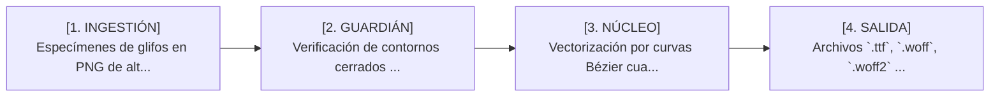

# 👑 FONTS-FORGE
> **Ethernium Sovereign Suite :: Nemeth Corp // Nulla Labs**  
> *Compilador de Fuentes Vectoriales Bézier & Motor PUA DRM Esteganográfico*

---

| Metadato | Valor Canónico |
| :--- | :--- |
| **Tier Arquitectónico** | `TIER 3: Motor Especializado & Swarm` |
| **Repositorio Canónico** | [`SteveBlackbeard/FONTS-FORGE-by-Ethernium`](https://github.com/SteveBlackbeard/FONTS-FORGE-by-Ethernium) |
| **Puerto / Interfaz** | `CLI Tool` |
| **Visibilidad** | `Private` |
| **Autoridad Soberana** | `SteveBlackbeard / NullaLabs / Nemeth Corp` |
| **Directiva de Autoría** | `ETH-GOLD-46 (Cero Atribución a IA)` |

---

## 🖼️ Diapositivas Ejecutivas en SVG Glassmorphic (Visualización Inmediata)

### 1. Portada y Homologación Ejecutiva


### 2. Misión y Dolor de la Industria Resuelto


### 3. Arquitectura Técnica y Badges Certificados


### 4. Pipeline Operacional y Flujo de Datos


### 5. Despliegue Local y Gobernanza


---

## 📥 Entregables y Recursos Descargables
- 📊 **Presentación Formal PowerPoint (.pptx):** [Descargar presentacion-fonts-forge.pptx](presentacion-fonts-forge.pptx)
- 📐 **Diagrama de Pipeline Vectorial (.svg):** [Ver pipeline-diagram.svg](pipeline-diagram.svg)

---

## 🎯 1. ¿Para qué está construido y por qué?

### ⚠️ El Dolor de la Industria (Problema Resuelto)
Los glifos y tipografías simbólicas personalizadas pierden calidad al rasterizarse y carecen de protección contra plagio o extracción no autorizada.

### 💎 Propósito Fundamental y Misión Soberana
Compilador tipográfico que transforma muestras PNG en fuentes vectoriales TTF, WOFF y WOFF2 con simplificación RDP y marcas de agua esteganográficas LSB.

---

## ⚙️ 2. Arquitectura Técnica y Capacidades Reales (Cero Humo)

### 🛠️ Stack Tecnológico
- **Python 3.10+**
- **OpenCV**
- **FontTools**
- **Algoritmo Ramer-Douglas-Peucker**
- **Esteganografía LSB**

### 📊 Métricas Empíricas Auditadas
Compilación de 928 símbolos en < 5s, contornos Bézier matemáticamente óptimos y firmado esteganográfico de autoría inviolable.

### 🛡️ Invariantes y Reglas de Oro Aplicables
- `ETH-GOLD-04 (Frugalidad)`
- `ETH-GOLD-46 (Autoría soberana)`

---

## 🔄 3. Pipeline Operacional y Flujo de Datos



- **Entrada:** Especímenes de glifos en PNG de alta resolución y tablas de codificación PUA
- **Guardián:** Verificación de contornos cerrados y normalización de cuadrícula de 1000 UPM
- **Núcleo:** Vectorización por curvas Bézier cuadráticas/cúbicas y simplificación RDP
- **Salida:** Archivos `.ttf`, `.woff`, `.woff2` y mapas tipográficos CSS listos para web

---

## 🚀 4. Despliegue Local y Auditoría

```bash
# Arranque / Servicio Local
python compile_fonts.py

# Verificación de Integridad y Tests
python test_fonts.py
```

---

## 🌐 5. Interconexiones en el Ecosistema
- ◈ **Thestral (:IDE)**
- ◈ **Platform (:3000)**
- ◈ **Worldbuilding Lore**
